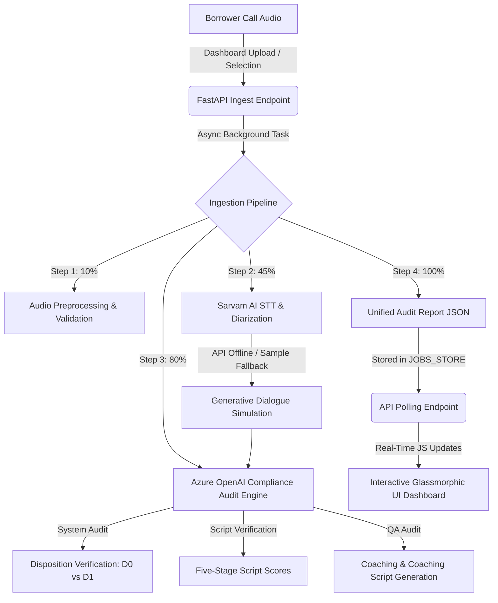

# 🎙️ DataSutram Echo — Voice Analytics & Compliance AI Platform

An enterprise-grade, compliance-intelligence, and speech-analytics platform tailored for banking and NBFC collections operations. **DataSutram Echo** automates post-call audits, monitors caller compliance, handles speaker diarization for Hinglish dialects, and detects target manipulation by debt-recovery agents.

Powered by a dual-stage pipeline featuring **Sarvam AI** for high-fidelity Speech-to-Text (STT) diarization and **Azure OpenAI** for multi-module LLM compliance audits, Echo transforms raw audio recordings into deep, actionable scorecards.

---

## 🌟 Key Capabilities

### 1. Bilingual ASR & Speaker Diarization (Sarvam AI)
* **Hinglish Native Processing:** Custom-tuned speech processing built on Sarvam AI's Batch ASR, optimized to transcribe mixed Hindi and English vocabulary fluently.
* **Telephony-Grade Speaker Diarization:** Separates borrower and agent channels, tracking precise conversation timelines, time-stamps, and speaker turns.
* **Context-Aware Simulation Fallback:** If live API keys are offline or when running local dry-runs, a metadata-driven generative simulation engine generates highly realistic synthetic conversations dynamically matching input notes and disposition codes.

### 2. Five-Stage Script Compliance Audit
The engine maps caller behavior against the bank's strict collections SOP:
* **Stage A: Greeting & Identity Verification** — Confirms greeting courtesy and positive identification of the debtor.
* **Stage B: Overdue Amount Statement** — Audits whether the agent explicitly stated the exact overdue amount in INR and the specific loan account number.
* **Stage C: Consequence Nudge** — Tracks whether the caller explained credit rating (CIBIL) score impact, penalty charges, and potential legal escalations.
* **Stage D: Delay Reason Extraction & Objection Handling** — Measures agent empathy, active listening, and whether the caller explored partial payments.
* **Stage E: Payment Commitment & Closing** — Validates if the agent secured a concrete payment commitment (specific amount, date, and method) and closed professionally.

### 3. Agent Target Manipulation & Fraud Detection
* **Disposition Verification (D0 vs. D1):** Automatically compares the agent's self-logged disposition (D0) against the AI's audited outcome (D1).
* **Severity-Graded Mismatch Warnings:** Categorizes discrepancies between agent notes and call reality:
  * 🟢 **NONE:** Perfect alignment.
  * 🟡 **MINOR:** Slight difference (e.g., logged "Promise to Pay" instead of "Partial Commitment").
  * 🟠 **SIGNIFICANT:** Target inflation (e.g., customer deflected with *"dekh lenge"* but agent logged "Promise to Pay").
  * 🔴 **CRITICAL:** Blatant violation (e.g., customer explicitly refused due to a medical emergency, but agent logged a "Promise to Pay" to satisfy performance quotas).

### 4. Advanced Call Intelligence & Coaching
* **Reason Verbatim Citations:** Extracts exact text quotes of customer grievances or disputes.
* **Customer Sentiment & Risk Profiling:** Profiles borrower emotional states (Cooperative, Neutral, Agitated, Hostile) and rates compliance/legal escalation risk (Low, Medium, High).
* **AI coaching feedback:** Generates tailored, actionable strengths, weaknesses, and a custom **alternative dialogue script** teaching the agent exactly how they should have handled objections.

### 5. Premium Glassmorphic Web UI
* Sleek, high-performance dark-mode dashboard styled with vanilla CSS.
* Interactive audio waveform player synced with dual-speaker side-by-side transcripts.
* Real-time status update logs powered by FastAPI's non-blocking background workers.
* Diagnostic scorecards featuring colorful gauges, mismatch alerts, and coaching summaries.

---

## 🛠️ Technology Stack

* **Backend Framework:** FastAPI (Asynchronous API, Background Tasks)
* **Application Server:** Uvicorn
* **STT Core API:** Sarvam AI Batch ASR API (v1)
* **AI Cognitive Engine:** Azure OpenAI (GPT Models via SDK)
* **Security & Auth:** Session-based authentication backed by bcrypt password hashing
* **Frontend UI:** HTML5 (Jinja2 Templates), Vanilla JavaScript, Glassmorphic Vanilla CSS

---

## 📁 Repository Structure

```hl
voice-analytics-ai/
├── app/
│   ├── pipeline/               # Core processing pipeline
│   │   ├── analyzer.py         # Asynchronous task runner & JOBS_STORE coordinator
│   │   ├── stt.py              # Sarvam AI STT client & high-fidelity simulation fallbacks
│   │   └── llm.py              # Azure OpenAI audit prompt engineer & schema parser
│   ├── static/                 # CSS, client-side JS, and media samples
│   │   ├── css/style.css       # Fully custom premium styles and animations
│   │   ├── js/main.js          # Audio playback, status polling, and state management
│   │   └── samples/            # Static high-fidelity demonstration audios
│   ├── templates/              # Jinja2 HTML layout pages
│   │   ├── base.html           # Unified shell template
│   │   ├── index.html          # Core Glassmorphic interactive dashboard
│   │   └── login.html          # Secure modern login gateway
│   ├── auth.py                 # Cryptographic authentication helpers & cookie verification
│   ├── config.py               # Central environment variable schema (Config class)
│   └── main.py                 # FastAPI initialization and middleware mounts
├── docs/                       # Project specifications (Call Analytics documentation)
├── uploads/                    # Target directory for custom ingested audio files
├── .env                        # Local environment configuration file
├── main.py                     # Entry point startup launcher script
└── requirements.txt            # Python environment dependencies definition
```

---

## 🔌 System Data & Audit Flow



---

## 🚀 Getting Started & Local Installation

### Prerequisites
* Python 3.8 or higher installed on your system.
* A modern web browser.

### 1. Clone the Project & Navigate to Root
```bash
git clone <repository_url>
cd voice-analytics-ai
```

### 2. Configure Your Virtual Environment
```bash
# Create the environment
python -m venv .venv

# Activate on Windows
.venv\Scripts\activate

# Activate on macOS/Linux
source .venv/bin/activate
```

### 3. Install Dependencies
```bash
pip install -r requirements.txt
```

### 4. Set Up Environment Configuration (`.env`)
Create a `.env` file in the root directory. Provide your API keys and configuration settings:

```ini
# --- Port Configuration ---
PORT=8000
HOST=127.0.0.1
RELOAD=True

# --- Speech to Text ---
SARVAM_API_KEY=your_sarvam_api_key_here

# --- Cognitive Services ---
AZURE_OPENAI_API_KEY=your_azure_openai_key_here
AZURE_OPENAI_ENDPOINT=https://your-endpoint.openai.azure.com/
AZURE_OPENAI_DEPLOYMENT_NAME=your_deployment_name_here

# --- Security Credentials ---
LOGIN_EMAIL=admin@audatec.in
# Bcrypt hash for default password: "admin123"
LOGIN_PASSWORD_HASH=$2b$12$jlBiHRzApNBl1BZiPiQsAObTcNjr0rrxsY9zCPVn42DWL9WWmWP0e
SECRET_KEY=audatec_super_secret_session_key_123456
```
> 💡 *Note: The pipeline includes smart mock fallbacks. If `SARVAM_API_KEY` or `AZURE_OPENAI_API_KEY` are not configured or fail, the platform will continue to function flawlessly using high-fidelity simulations for local evaluation.*

### 5. Launch the Platform
Start the FastAPI server via the entrypoint script:
```bash
python main.py
```

Open your browser and navigate to:
```text
http://127.0.0.1:8000
```

---

## 🔑 Default Authentication Credentials
Use these static administrative credentials to access the primary interactive dashboard:
* **Administrative Email:** `admin@audatec.in`
* **Security Password:** `admin123`

---

## 🎯 Interactive Presentation Scenarios
Echo includes three preloaded high-fidelity demonstration recordings that illustrate realistic field scenarios:

### 🟢 Scenario 1: **Cooperative / Immediate Payment** (`sample_paid.mp3`)
* **Context:** Loan EMI of Rs. 12,500 is overdue due to out-of-town travel.
* **Call Profile:** Agent handles the call with high script compliance. Leverages CIBIL impact consequence nudge.
* **Result:** Customer cooperatively pays via Google Pay during the call.
* **Audit Outcome:** 100% compliance match. 9.3/10 Agent score.

### 🔴 Scenario 2: **Emergency Refusal & Agent Fraud** (`sample_refused.mp3`)
* **Context:** Customer's father is hospitalized, creating a severe medical emergency.
* **Call Profile:** Agent displays a complete lack of empathy, skips objection handling, and prematurely cuts the call, sending a payment link. The agent logs a **"Promise to Pay"** to inflate performance numbers.
* **Result:** Flat refusal due to absolute lack of emergency funds.
* **Audit Outcome:** 🚨 **CRITICAL DISPOSITION MISMATCH**. AI identifies true outcome as `REFUSED` and flags agent target manipulation.

### 🟡 Scenario 3: **Billing Dispute & Escalation Risk** (`sample_disputed.mp3`)
* **Context:** Auto-debit bounce dispute over an extra charge of Rs. 5,000.
* **Call Profile:** Customer is hostile, threatening consumer court and RBI complaints. Agent gets defensive and matches the customer's high volume instead of de-escalating.
* **Result:** Stand-off. Customer hangs up.
* **Audit Outcome:** **HIGH ESCALATION RISK**. AI advises immediate hold on automated calls and routes to manual Grievance Resolution.

---

## 🔒 Security & Performance Features
* **Anti-Back-Button Cache Locks:** dashboard endpoints utilize aggressive `no-store`, `no-cache` cache control headers to prevent unauthorized page restoration post-logout.
* **Front-End Auth Syncing:** Javascript polling continuously validates session state (`/api/auth-check`) on tab focus, instantly redirecting expired sessions.
* **Asynchronous Telephony Pools:** Teletranscriptions are run in standard event-loop executors (`run_in_executor`) to prevent synchronous HTTP request calls from blocking FastAPI's concurrent workers.
